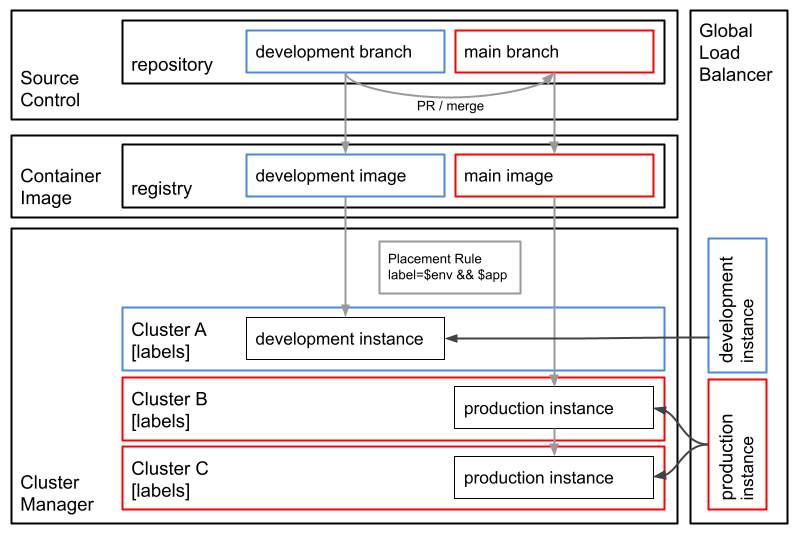
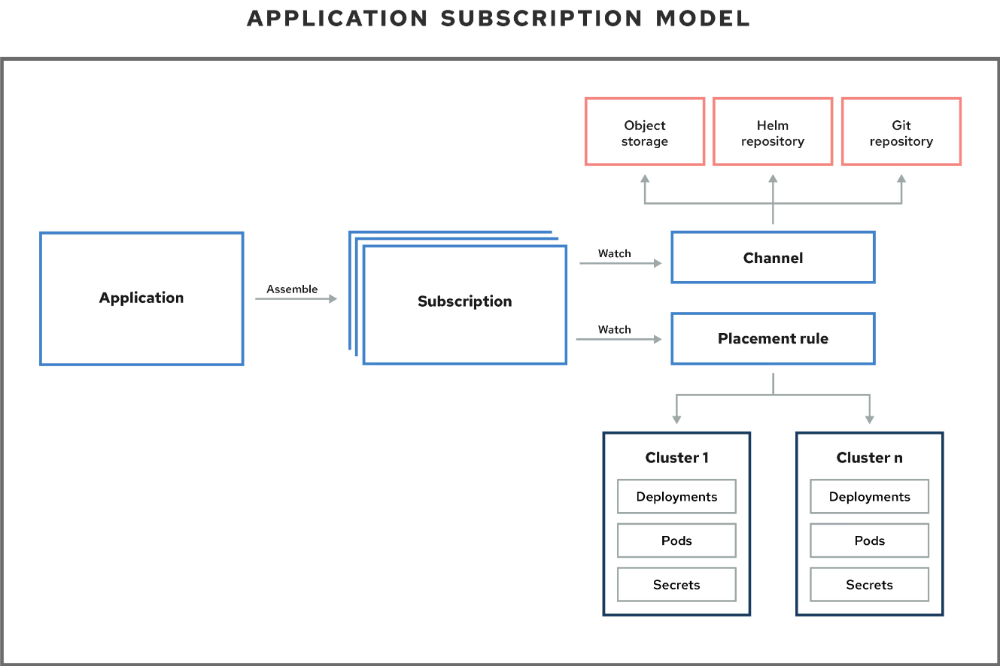

Gitlab integration with ACM





Edit secrets.yaml
git update-index --assume-unchanged secrets.yaml

Create project and namespace
```sh
oc create -f multi-cloud/app.yaml --save-config
```

Create Access Token with api role
```sh
token=--add-token-here--
email=--add-email-here--
oc project multi-cloud
oc delete secret gitlab-registry-auth
oc delete secret gitlab-repo-auth
kubectl create secret docker-registry gitlab-registry-auth \
        --docker-server=registry.gitlab.com \
        --docker-username=openshift-token\
        --docker-password=$token\
        --docker-email=$email
kubectl create secret docker-registry gitlab-repo-auth \
        --docker-server=gitlab.com \
        --docker-username=openshift-token\
        --docker-password=$token\
        --docker-email=$email
oc secrets link default gitlab-registry-auth --for=pull
oc secrets link default gitlab-repo-auth --for=pull
gitlabRegistryAuth=$(oc get secret gitlab-registry-auth -o=jsonpath='{ .data.\.dockerconfigjson }')
gitlabRepoAuth=$(oc get secret gitlab-repo-auth -o=jsonpath='{ .data.\.dockerconfigjson }')
perl -pe "s/GITLAB_REGISTRY_AUTH/$gitlabRegistryAuth/" deployment/secrets.yaml.tmpl | \
perl -pe "s/GITLAB_REPO_AUTH/$gitlabRepoAuth/" > deployment/secrets.yaml
```

```sh
oc create -f secrets.yaml --save-config
oc secrets link default gitlab-access-token --for=pull -n multi-cloud
```

```sh
cd deployment
./setup.sh
```
